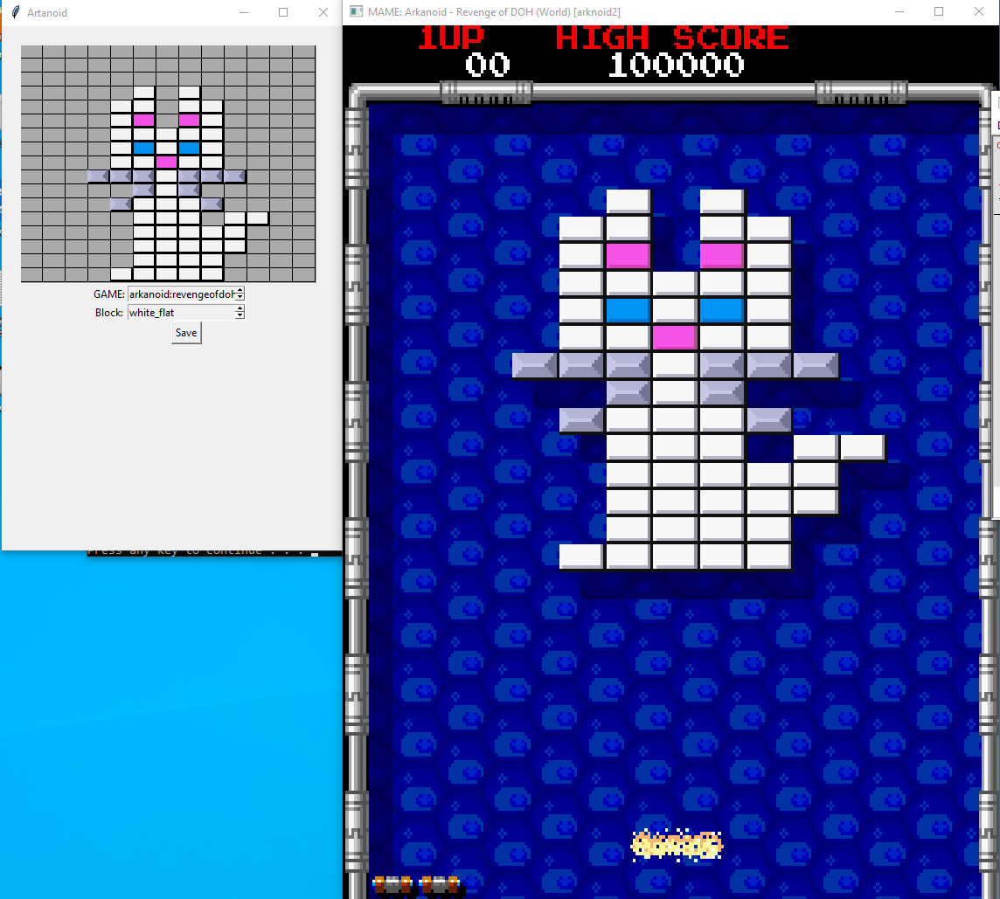

# Artanoid
Arkanoid and Arkanoid Revenge of Doh Editor


# What does this do
If provided the proper ROM file, this tool will generate new ROM files to overwrite the existing ROMS for either of these games.
Block data will be applied AS WELL AS the necessary hacks to jump past ROM checks which are necessary to play any modifications to these games in MAME or on a real machine.
In short, you draw with the tool. The tool writes all the annoying hex values where they need to go for the block data AND rom checks.

# Requirements (as of 3/12/2024)
* Runs on **Python 3.10.11***
  * Uses **tkinter** library as the UI ```pip install tk```
* You'll need a ROM copy of Arkanoid and Arkanoid: Revenge of Doh (World Edition)
  * Both are not needed! Just the ones necessary for the game you want to edit.

# Setup (as of 3/12/2024)
## Preparing your MAME folder
1) Start by **backing up** then **unzip** the arkanoid roms into the ROM directory for your MAME emulator
2) **Rename the backup ZIP roms**, otherwise you will not be saving changes!

## Preparing this python application
1) In the root of this project, create a folder called **data**
2) From the roms folder you copied in "Preparing your MAME folder", copy the following ROM files into the newly created **data** folder on your root:
**Arkanoid Revenge of Doh:** -> copy b08_13.3e 
**Arkanoid:** -> copy ????? (working on it ok!)

## Running the application
1) Start with whatever flavor of tool you want to use to start a python app. I use **VSCode** since im also developing it
2) Select the game you want to generate a level for
3) Select the block type you want to place
4) **Left click adds** the block, **Right click removes** the block
5) Click Save
6) Goto the data folder, you'll see a file with **.new** at the end. this is our output!

## Running in Mame
1) Copy the **.new** file to the ROM folder in your MAME setup
2) Rename the old file (ex:**b08_13.3e.old**), replace it with the new file (so just remove the .new)
3) run the rom **from the command line!**
   I've only been able to get this to run on an older version of mame...heads up!

# Some shortcuts
* For windows users, I have a bat script I use to do my copy and pasting from the repo to my MAME roms. I also launch my game this way. IT WILL SAVE TIME.
 * ```xopy "/path/to/data/in/this/repo" "/path/to/mame/rom/folder/nowfilenamehere.extension"```
 * ```./mame64 arkanoid2``` run without debug mode
 * ```./mame64 arkanoid2 --debug``` run WITH debug mode if you want to use the memory assembler to see your changes

# Resources
* [Memory Mapping for Arkanoid Revenge of Doh](http://www.arcaderestoration.com/memorymap/365/Arkanoid+-+Revenge+of+DOH.aspx)
* [Initial thread I created to track my progress on this tool](https://www.romhacking.net/forum/index.php?topic=38737.0)
